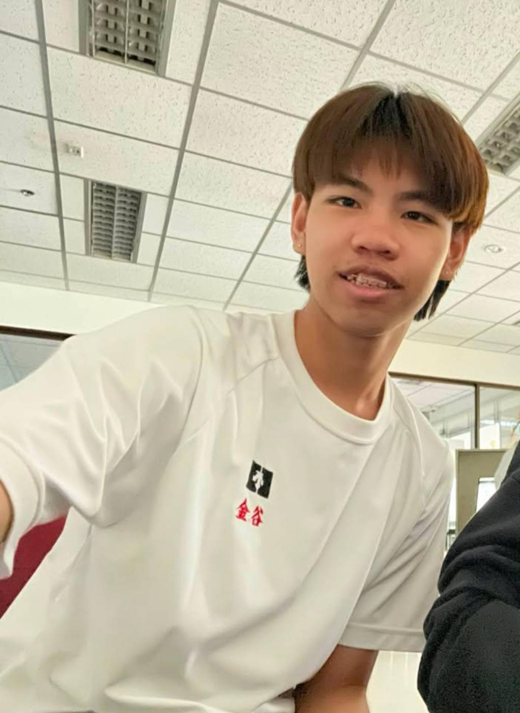
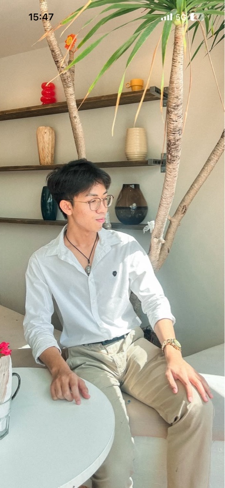
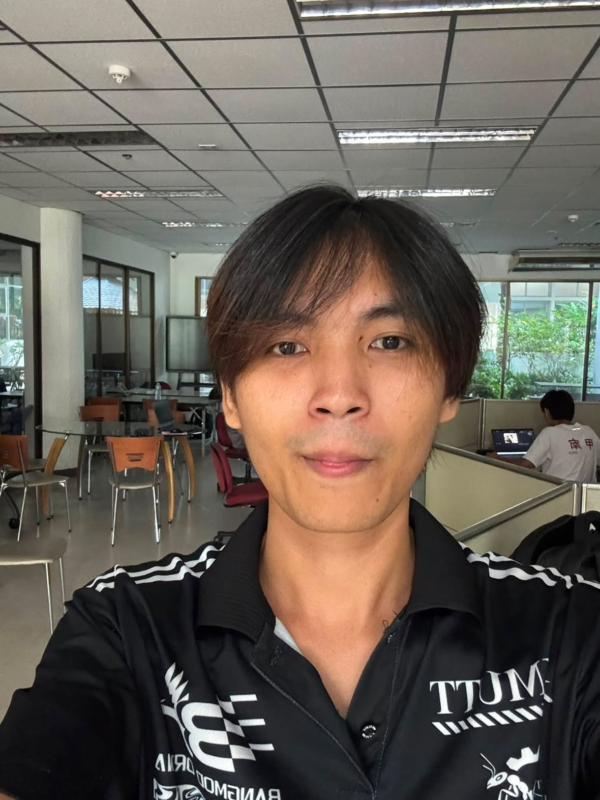
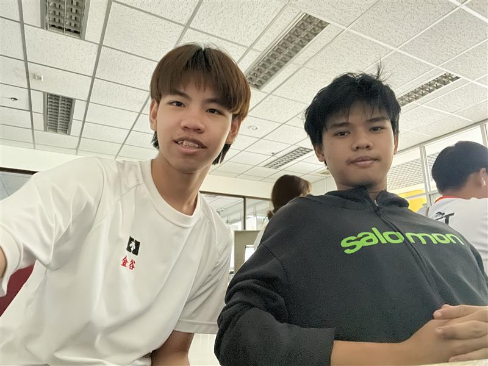

## นายนิติธาดา เคารพธรรม (Ter) ผู้ให้สัมภาษณ์ 030

## 1. ช่วงเวลาที่ผ่านมาในชีวิต 👨🏻‍💼
มีเหตุการณ์ไหนที่เปลี่ยนมุมมองหรือความคิดของคุณมากที่สุด เพราะอะไร? : ช่วงที่ลงสมัครประธานนักเรียน แล้วได้ไปเข้าทำงานในสภา เพราะต้องทำงานร่วมกับเพื่อนและคุณครู คนจากที่อื่น ช่วยให้ความคิด การจัดการ การบริหารดีขึ้นมาก

## 2. เกี่ยวกับมหาลัย 💻
คุณคาดหวังอะไรจากชีวิตมหาลัย และอยากให้ตัวเองได้อะไรกลับไปเมื่อเรียนจบ? : อยากรับความรู้และประสบการณ์ทุกอย่าง อยากรับมาให้หมดที่ได้เรียน อยากลองใช้ชีวิตในแบบของตัวเอง อยากมีความสามารถที่ไปทำงานได้ในสายที่ถนัดและชอบ อยากมีประสบการณ์ในการทำงาน

## 3. เกี่ยวกับความสัมพันธ์ ♥️
สำหรับคุณ ความสัมพันธ์ที่ดีควรเป็นแบบไหน และอะไรคือสิ่งสำคัญที่สุดในการรักษาความสัมพันธ์? : ความสัมพันธ์ที่มี good talk ต้องฟังกันและกัน ช่วยกันและกัน และไม่ตัดสินใจหรือตัดสินอะไรด้วยตัวเอง ต้องรับฟังให้มากกว่าพูด สิ่งสำคัญในการรักษาความสัมพันธ์คือต้องมั่นคงกับสิ่งที่เลือก

## 4. เกี่ยวกับสุขภาพ 🏃
คุณมีวิธีดูแลสุขภาพกายและสุขภาพใจของตัวเองอย่างไรในชีวิตประจำวัน? : 
ออกกำลังกายอย่างน้อยอาทิตย์ล่ะ 3 ครั้ง ไม่ให้ร่างกายขาดการออกมากจนเกินไป เพื่อสุขภาพที่ดี ทำในสิ่งที่ตัวเองชอบ และสนใจ สามารถทำได้เสมอ ช่วยให้จิตใจสงบ และได้กลับทบทวนตัวเองด้วย

## 5. เกี่ยวกับงานอดิเรก 📋
งานอดิเรกที่คุณชอบทำคืออะไร และอะไรทำให้คุณสนุกหรือรู้สึกมีความสุขเวลาทำสิ่งนั้น? : ชอบวาดรูป ชอบคุยกับคนอื่น รู้สึกว่าการวาดรูปหรือการคุยกับอื่นทำให้เราได้แลกเปลี่ยนความคิดของตัวเองกับคนอื่น สนุกตรงที่ได้คุยกับคนอื่นในเรื่องใหม่ๆ

## instagram https://www.instagram.com/t.nxtd_/##

## ผู้สัมภาษณ์ นายภัทรดนัย แจ่มประทีป 043 

---------------------------------------------------------------------------------------------------------

## Vorathep Boonsuan (New) ผู้ให้สัมภาษณ์ 051

## 👤 เกี่ยวกับชีวิต
- **ชื่อ-นามสกุล:** Vorathep Boonsuan
- **ชื่อเล่น:** นิว
- **อายุ:** 19 ปี

## 🎓 เกี่ยวกับมหาลัย
- **ประวัติการศึกษา:** ปัจจุบันอยู่ IT KMUTT
- **เหตุผล:** เรียน FIBO แล้วกิจกรรมเยอะ ไม่มีเวลาว่างในการทำงานนอก คิดจะซิ่วตั้งแต่ปี 1 เทอม 1
- **สไตล์การทำงาน:** เป็นคนชอบทำงานนอก

## 🫂 เกี่ยวกับความสัมพันธ์
- **เพื่อน:** รู้สึกแฮปปี้
- **ครอบครัว:** รู้สึกแฮปปี้
- **ความรัก:** โสด (เคยมีแฟนแต่เลิกกันเพราะ LDR อยู่คนละมหาลัย ทำให้รู้สึกห่างกัน) ชอบคนที่อยู่ใกล้ ใช้เวลาด้วยกัน

## 🍦 เกี่ยวกับสุขภาพ
- **การออกกำลังกาย:** ชอบเวทเทรนนิ่ง และวิ่ง
- **เป้าหมาย:** อยากมีกล้าม, สุขภาพร่างกายแข็งแรง และโชว์สาว
## 🏋️ เกี่ยวกับงานอดิเรก
  - **ข้อจำกัดช่วงนี้:** พอเปิดเทอมไม่มีเวลาว่างไปออกกำลังกาย เพราะต้องเรียนและรับงานนอกในตอนเย็น
- **เวลาว่าง:** ชอบไปนั่งคาเฟ่ จิบกาแฟชิวๆ อยากไปต่างประเทศ
- **การจัดการความเครียด:** เวลาทำงานแล้วเครียด จะเลิกทำสิ่งที่เครียด แล้วหาคนคุยด้วยเพื่อคลายเครียด

[IG :] https://www.instagram.com/newvorathep/?hl=en

## Chittiphat Sarabua ผู้สัมภาษณ์ 007

---------------------------------------------------------------------------------------------------------

# Chittiphat Sarabua (Top) ผู้ให้สัมภาษณ์ 007

> ✍️ Introduction written by: Vorathep Boonsuan (New) 051

## 👤 About Top

- อายุ: 20 ปี
- เรียน: Information Technology (IT), SIT KMUTT

## 🌃 About His Life

- เป็นคนที่มีความสุขกับการใช้ชีวิต
- ชอบใช้ชีวิตกลางคืน
- รักอิสระและชอบใช้ชีวิตในแบบของตัวเอง

## 🎓 About University

- เคยเรียนสาขาเมคคาทรอนิกส์มาก่อน แล้วตัดสินใจซิ่วมาสาย IT
- รู้สึกว่าไม่ค่อยชอบด้าน Hardware และถนัดด้าน Software มากกว่า
- มีความสนใจด้าน Computer Science
- เริ่มคิดเรื่องการย้ายสาขาตั้งแต่ช่วงเทอม 2
- หลังจากย้ายมาเรียน IT รู้สึกมีความสุขและชอบสาขานี้มากขึ้น

## ❤️ Relationships

- มีความสัมพันธ์ที่ดีกับครอบครัวและใช้ชีวิตร่วมกันอย่างมีความสุข
- ด้านความรัก ชอบความเป็นส่วนตัว แต่ก็ต้องการมีความรักและความสัมพันธ์ที่ดี

## 🏸 Health

- ชอบเล่นแบดมินตันเพื่อดูแลสุขภาพ
- การเล่นแบดมินตันยังช่วยให้ได้เจอคนใหม่ ๆ และสร้างความสัมพันธ์กับผู้อื่น

## 🎮 Hobbies

- 🎮 เล่นเกม
- ✈️ ไปเที่ยว
- 😴 พักผ่อน

## 🔗 More About Top

- 📱 Instagram: [Instagram](https://www.instagram.com/qottopqxt.t/)

## Vorathep Boonsuan (New) ผู้สัมภาษณ์ 051

---------------------------------------------------------------------------------------------------------

## นายจิรายุธ บูรณะจันทร์ 008 ผู้ให้สัมภาษณ์ ❄❄

### 1. เกี่ยวกับชีวิต🥰🥰

    เป็นคนที่มีความตั้งใจและค่อนข้างจริงจังกับสิ่งที่ตัวเองสนใจ ชอบเรียนรู้และพัฒนาตัวเองอยู่เสมอ ถ้ามีเรื่องที่สงสัยจะพยายามหาคำตอบและทำความเข้าใจให้ได้ เป็นคนที่มีความคิดสร้างสรรค์ มีอารมณ์ขัน และสามารถปรับตัวกับสถานการณ์ต่าง ๆ ได้ดี นอกจากนี้ยังเป็นคนที่ตั้งเป้าหมายให้กับตัวเองและพยายามทำให้สำเร็จ

### 2. เกี่ยวกับมหาวิทยาลัย🤓🤓

    ปัจจุบันเรียนอยู่ในสาย IT ที่มหาวิทยาลัยเทคโนโลยีพระจอมเกล้าธนบุรี (KMUTT) เป็นสาขาที่สนใจและตั้งใจเลือกเรียน เพราะชอบเรื่องคอมพิวเตอร์และเทคโนโลยี โดยเฉพาะการเขียนโปรแกรม การพัฒนาเว็บไซต์ และการสร้างสิ่งต่าง ๆ ด้วยตัวเอง อยากใช้ชีวิตมหาวิทยาลัยในการเรียนรู้ทักษะใหม่ ๆ ทำโปรเจกต์ และค้นหาว่าตัวเองถนัดหรืออยากไปต่อในด้านไหนของ IT ในอนาคต

### 3. เกี่ยวกับความสัมพันธ์😳😳

    ให้ความสำคัญกับความสัมพันธ์ที่มีความเข้าใจและความไว้ใจซึ่งกันและกัน มองว่าการสื่อสารเป็นสิ่งสำคัญ เพราะการพูดคุยกันอย่างตรงไปตรงมาสามารถช่วยลดความเข้าใจผิดได้ เป็นคนที่ให้ความสำคัญกับคนรอบตัวและคิดว่าความสัมพันธ์ที่ดีไม่จำเป็นต้องเห็นด้วยกันทุกเรื่อง แต่ควรรับฟังความคิดเห็นและเคารพความรู้สึกของกันและกัน

### 4. เกี่ยวกับสุขภาพ🧐🧐

    มองว่าสุขภาพเป็นพื้นฐานสำคัญของการใช้ชีวิต เพราะถ้าสุขภาพไม่ดีจะส่งผลต่อทั้งการเรียน การทำงาน และกิจกรรมต่าง ๆ ในชีวิตประจำวัน จึงพยายามใส่ใจทั้งสุขภาพกายและสุขภาพจิตของตัวเอง รวมถึงระมัดระวังเรื่องต่าง ๆ ที่อาจส่งผลต่อสุขภาพ และพยายามรักษาสมดุลระหว่างการเรียน การพักผ่อน และเวลาส่วนตัว

### 5. เกี่ยวกับงานอดิเรก👺👺

    ชอบเล่นเกม โดยเฉพาะเกมแนว FPS และใช้เวลาว่างกับคอมพิวเตอร์ นอกจากการเล่นเกมแล้วยังสนใจด้าน Programming และ Technology ชอบลองเขียนโค้ด ทดลองทำเว็บไซต์ และสนใจการพัฒนาเกม เพราะรู้สึกสนุกกับการได้สร้างสิ่งต่าง ๆ ขึ้นมาด้วยตัวเอง งานอดิเรกเหล่านี้จึงไม่ได้มีแค่ความบันเทิง แต่ยังช่วยให้ได้ฝึกคิด วิเคราะห์ แก้ปัญหา และเรียนรู้ทักษะใหม่ ๆ ไปพร้อมกันด้วย

## INSTAGRAM USER LINK:https://www.instagram.com/ice.e_jirayut

 

## น.ส.วรรณษา มณีเขียว 054 ผู้สัมภาษณ์ 🙈🙈

---------------------------------------------------------------------------------------------------------

## นส.วรรณษา มณีเขียว ผู้ให้สัมภาษณ์ 054

# 1. เกี่ยวกับชีวิต😏😏 
— ช่วงเวลาที่ผ่านมาในชีวิต มีเหตุการณ์ไหนที่เปลี่ยนมุมมองหรือความคิดของคุณมากที่สุด เพราะอะไร?

ช่วงเวลาที่เปลี่ยนมุมมองมากที่สุดคือช่วงที่ต้องเตรียมตัวเข้ามหาวิทยาลัย เพราะทำให้รู้ว่าตั้งเป้าหมายอย่างเดียวไม่พอ แต่ต้องมีความพยายามและรับผิดชอบกับสิ่งที่ตัวเองเลือกด้วย ทำให้มองว่าความผิดพลาดไม่ใช่สิ่งที่ต้องกลัว แต่เป็นสิ่งที่ช่วยให้เราเรียนรู้และพัฒนาตัวเองได้ดีมากขึ้น

# 2. เกี่ยวกับมหาลัย😉😉
 — คุณคาดหวังอะไรจากชีวิตมหาลัย และอยากให้ตัวเองได้อะไรกลับไปเมื่อเรียนจบ?

คาดหวังว่าจะได้เรียนรู้ทั้งความรู้ในสาขาที่เข้าเเละประสบการณ์จากการทำงานร่วมกับคนอื่น อยากพัฒนาตัวเองให้มีทั้งทักษะด้านวิชาการ การแก้ปัญหา และการทำงานเป็นทีม เมื่อเรียนจบอยากเป็นคนที่มีความรู้และสามารถนำสิ่งที่เรียนไปใช้แก้ปัญหาในชีวิตจริงและการทำงานได้

# 3. เกี่ยวกับความสัมพันธ์😘😘
 — สำหรับคุณ ความสัมพันธ์ที่ดีควรเป็นแบบไหน และอะไรคือสิ่งสำคัญที่สุดในการรักษาความสัมพันธ์?

ความสัมพันธ์ที่ดีคือการที่ทั้งสองฝ่ายสามารถเป็นตัวของตัวเอง สิ่งสำคัญที่สุดคือความเข้าใจและการสื่อสาร เพราะแต่ละคนมีความคิดและความรู้สึกที่แตกต่างกัน ถ้าเรารับฟังกันและพร้อมปรับตัว ความสัมพันธ์ก็จะสามารถเดินต่อไปได้

# 4. เกี่ยวกับสุขภาพ🍦🍦
 — คุณมีวิธีดูแลสุขภาพกายและสุขภาพใจของตัวเองอย่างไรในชีวิตประจำวัน?

ในชีวิตประจำวันพยายามดูแลตัวเองด้วยการพักผ่อนให้เพียงพอ  และหาเวลาทำกิจกรรมที่ช่วยให้ตัวเองผ่อนคลาย ช่วงนี้พยายามหาเวลาไปออกกำลังกายบ่อยๆ

# 5. เกี่ยวกับงานอดิเรก🤟🤟
 — งานอดิเรกที่คุณชอบทำคืออะไร และอะไรทำให้คุณสนุกหรือรู้สึกมีความสุขเวลาทำสิ่งนั้น?
 
ชอบฟังเพลงและนอนดู Netflix เเละการได้ใช้เวลากับตัวเองทำให้รู้สึกมีความสุขได้ทบทวนตัวเองได้หลายอย่างว่าควรเปลี่ยนหรือ
พัฒนาอะไรบ้าง

## INSTAGRAM USER LINK: https://www.instagram.com/ma_wxm/

## นายจิรายุธ บูรณะจันทร์ ผู้สัมภาษณ์ 008

---------------------------------------------------------------------------------------------

## นายภัทรดนัย แจ่มประทีป 043 ผู้ให้สัมภาษณ์

# คำถามที่ 1. เกี่ยวกับชีวิต ♥️

ช่วงเวลาที่ผ่านมาในชีวิต มีเหตุการณ์ไหนที่เปลี่ยนมุมมองหรือความคิดของคุณมากที่สุด เพราะอะไร?

:เกี่ยวกับชีวิตช่วงเวลาที่ผ่านก็สบายไม่มีปัญหาอะไรเป็นพิเศษทุกอย่างราบลื่นดีมีปัญหาเดียวคือเรื่องค่าเทอม

# คำถามที่ 2. เกี่ยวกับมหาลัย ✌🏻

คุณคาดหวังอะไรจากชีวิตมหาลัย และอยากให้ตัวเองได้อะไรกลับไปเมื่อเรียนจบ?

:เกี่ยวกับมหาลัย ความรู้ที่นำไปใช้ในการทำงานได้จริง

# คำถามที่ 3. เกี่ยวกับความสัมพันธ์ 🫶🏻

สำหรับคุณความสัมพันธ์ที่ดีควรเป็นแบบไหนและอะไรคือสิ่งสำคัญที่สุดในการรักษาความสัมพันธ์?

:เกี่ยวกับความสัมพันธ์ ความสัมพันธ์ดีหมดทุกด้านทั้งด้านครอบครัวด้านความรักแล้วก็ด้านเพื่อนฝูง

# คำถามที่ 4. เกี่ยวกับสุขภาพ 😘

คุณมีวิธีดูแลสุขภาพกายและสุขภาพใจของตัวเองอย่างไรในชีวิตประจำวัน?

:เกี่ยวกับสุขภาพ สุขภาพก็ดีแต่ก็ไม่ได้ดีมากเพราะการดูแลไม่ค่อยดีเท่าไหร นอนดึก ไม่ค่อนออกกำลังกาย กินข้าวไม่ค่อยตรงเวลา ตอนนี้สุขภาพไม่ได้แย่แต่ถ้าเป็นอย่างงี้ต่อไปก็ไม่แน่

# คำถามที่ 5. เกี่ยวกับงานอดิเรก 🤟🏻

งานอดิเรกที่คุณชอบทำคืออะไร และอะไรทำให้คุณสนุกหรือรู้สึกมีความสุขเวลาทำสิ่งนั้น?:เกี่ยวกับงานอดิเรก มีการเล่นเกมเป็นงานอดิเรก เพราะชอบเล่นมาตั้ง

## INSTAGRAM USER LINK: https://www.instagram.com/thankyou_13_13/

## นายนิติธาดา เคารพธรรม ผู้สัมภาษณ์ 030
